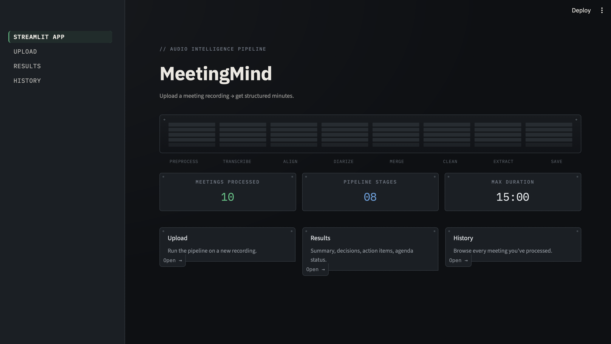
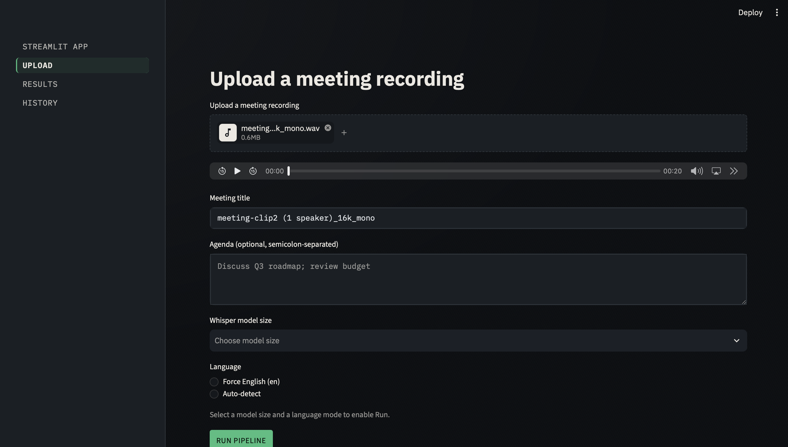
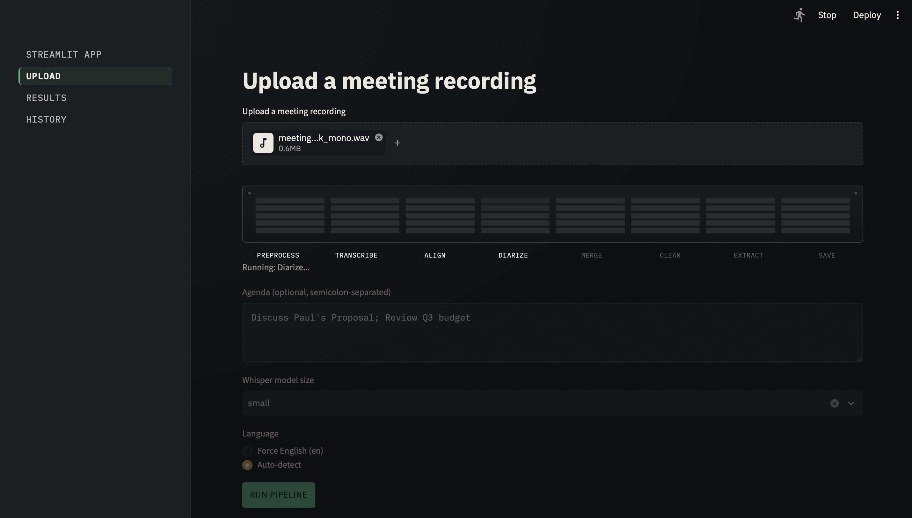
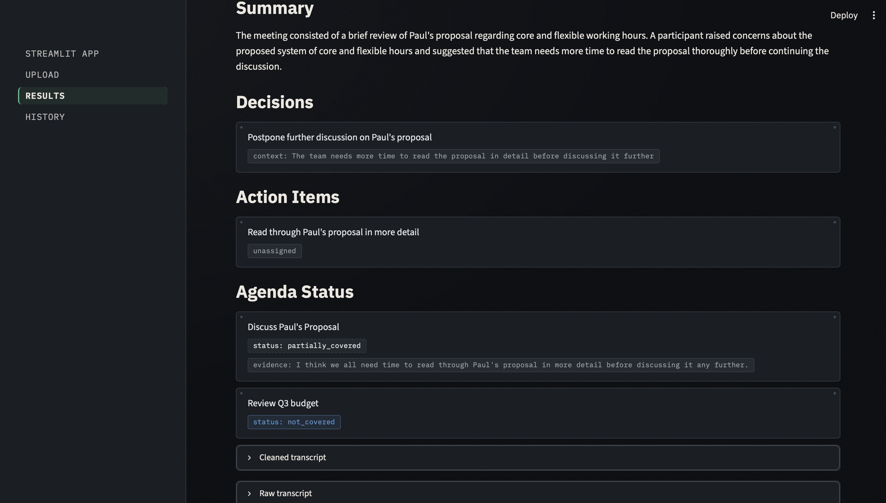
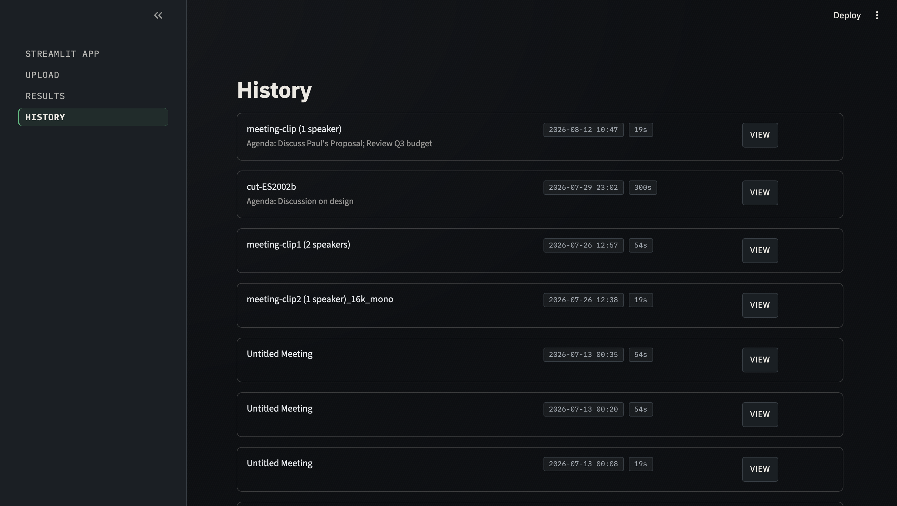

# MeetingMind

[](https://www.python.org/)
[](LICENSE)
[](https://streamlit.io/)
[](https://www.postgresql.org/)
[](https://ai.google.dev/)
[](https://github.com/SYSTRAN/faster-whisper)
[](https://github.com/pyannote/pyannote-audio)

**[Setup](#setup) · [Running Locally](#running-locally) · [Architecture](#pipeline) · [Design Decisions](#design-decisions) · [Evaluation](EVALUATION.md) · [Live Demo](#live-demo)**



An end-to-end AI meeting assistant. Upload raw meeting audio, get back structured
minutes: a summary, key decisions, action items (assignee/task/deadline), and an
agenda-completion check — all self-hosted, no third-party ASR/diarization APIs.

Built as a portfolio project to demonstrate a full ML pipeline end to end: audio →
transcription → diarization → structured LLM extraction → relational storage → a
usable web frontend, entirely on free-tier tooling.

## Pipeline

```
Audio upload (Streamlit)
  → FFmpeg preprocessing (16kHz mono WAV)
  → faster-whisper transcription (int8 quantized)
  → whisperX forced alignment
  → pyannote.audio speaker diarization
  → merge (word-level speaker assignment via time-overlap)
  → transcript cleaner (filler-word / punctuation cleanup)
  → Gemini structured extraction (Pydantic-validated JSON)
  → PostgreSQL (via SQLAlchemy)
  → Streamlit results view + Markdown/PDF export
```

## Tech Stack

| Layer | Tool |
|---|---|
| Preprocessing | FFmpeg |
| Transcription | faster-whisper (`small`/`medium`, int8, CPU) |
| Alignment | whisperX (forced phoneme-level alignment) |
| Diarization | pyannote.audio (`pyannote/speaker-diarization-3.1`) |
| Structured extraction | Google Gemini (`gemini-3.5-flash`, free tier) + Pydantic schemas |
| Database | PostgreSQL + SQLAlchemy |
| Frontend | Streamlit |
| Export | fpdf2 (PDF) / Markdown |
| Deployment | Cloudflare Tunnel (on-demand, not persistent uptime) |

## Repository Structure

```
meetingmind/
├── app/
│   ├── pipeline/
│   │   ├── preprocess.py       # FFmpeg audio preprocessing
│   │   ├── transcribe.py       # faster-whisper transcription
│   │   ├── align.py            # whisperX forced alignment
│   │   ├── diarize.py          # pyannote speaker diarization
│   │   ├── merge.py            # merge transcript + speaker segments
│   │   ├── clean.py            # transcript cleaner
│   │   └── extract.py          # Gemini structured extraction
│   ├── db/
│   │   ├── models.py           # SQLAlchemy models
│   │   ├── session.py          # DB engine/session setup
│   │   ├── crud.py             # insert/fetch functions
│   │   └── init_db.py          # one-time table creation
│   ├── schemas/
│   │   └── extraction.py       # Pydantic schemas (MeetingSummary, Decision, ActionItem, AgendaItemResult)
│   └── frontend/
│       ├── streamlit_app.py    # main app entrypoint
│       ├── pages/
│       │   ├── 1_upload.py     # upload + run pipeline
│       │   ├── 2_results.py    # results view
│       │   └── 3_history.py    # past meetings
│       └── utils/
│           ├── theme.py        # shared UI theme + session defaults
│           └── export.py       # Markdown/PDF export
├── tests/
│   └── test_extraction.py      # manual end-to-end integration script
├── sample_data/                # gitignored — local test clips (AMI Corpus + personal recordings)
├── .streamlit/
│   └── config.toml             # theme config
├── run_pipeline_to_db.py       # CLI driver: run the full pipeline on one file, save to DB
├── .env.example
├── .gitignore
├── requirements.txt
└── README.md
```

## Setup

```bash
git clone git@github.com:mehakjain-hub/meetingmind.git
cd meetingmind

python3 -m venv .venv
source .venv/bin/activate          # .venv\Scripts\activate on Windows

pip install -r requirements.txt

# FFmpeg (macOS)
brew install ffmpeg

# PostgreSQL (macOS)
brew install postgresql@14
brew services start postgresql@14
createdb meetingmind
```

Copy `.env.example` to `.env` and fill in:

```
DB_HOST=localhost
DB_PORT=5432
DB_NAME=meetingmind
DB_USER=<your postgres user>
DB_PASSWORD=

GEMINI_API_KEY=<your Gemini API key>       # free tier: https://ai.google.dev
HF_TOKEN=<your HuggingFace token>          # needed for pyannote's gated model
```

Then create the tables:

```bash
python -m app.db.init_db
```

## Running Locally

```bash
python -m streamlit run app/frontend/streamlit_app.py
```

Run from the project root with `.venv` active — avoids conda/PATH conflicts with
system Python.

Or, to test the pipeline end to end from the command line without the UI:

```bash
python run_pipeline_to_db.py path/to/audio.wav --title "Team Standup" --agenda "Discuss Q3 roadmap; review budget"
```

## Live Demo

Not persistently hosted — this runs on-demand via Cloudflare Tunnel from a local
machine rather than a paid hosting tier, so there isn't a permanent public URL. If
you'd like to see it live, reach out and I can spin up a tunnel and share the link
for a walkthrough.

## Screenshots

**Upload** — pick a file, choose model size and language mode



**Pipeline running** — live progress through preprocessing, transcription, alignment, diarization, cleaning, and extraction



**Results** — summary, decisions, action items, and three-state agenda coverage (covered / partially covered / not covered)



**History** — past meetings, persisted in PostgreSQL



## Design Decisions

A few constraints were deliberate, not oversights — noted here so they read as
scoping decisions rather than limitations discovered after the fact:

- **~15-minute input cap.** Keeps inference time predictable on free-tier CPU
  compute (no GPU). Longer files are rejected up front with a clear message rather
  than silently timing out.
- **English-only in v1.** Whisper handles Hindi-English code-switching
  inconsistently (see `EVALUATION.md`) — rather than ship unreliable multilingual
  support, v1 scopes to English and documents the finding as v2 groundwork.
- **Self-hosted pipeline, no third-party ASR/diarization APIs.** Whisper and
  pyannote run locally rather than being offloaded to a paid transcription service
  — the point of this project is demonstrating the pipeline itself.
- **On-demand deployment, not persistent hosting.** Cloudflare Tunnel from a local
  machine, run when needed for a demo, instead of a free-tier host that would add
  cold starts, resource limits, or eventual paid-tier pressure.

## Known Limitations

See `EVALUATION.md` for the full write-up, including specific test findings and a
log of the pre-v1.0 bug-triage pass. Short version:

- Whisper mangles proper nouns on heavily accented speech (upstream limitation).
- Gemini's free tier can hit sustained capacity 503s during peak hours; the
  pipeline retries transient errors but won't ride out an extended outage.
- No automated test suite yet — `tests/test_extraction.py` is a manual integration
  script. Formal pytest coverage is a v2 goal.

## License

MIT — see [LICENSE](LICENSE).

## Stretch Goals (v2)

Docker containerization · GitHub Actions CI · pytest coverage · follow-up email
generation · multilingual support · real-time meeting support
